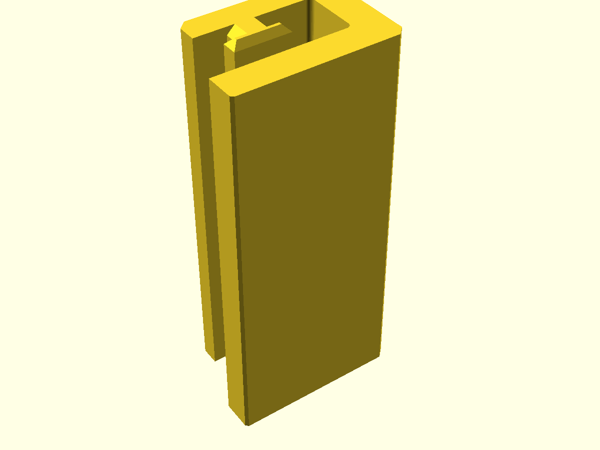
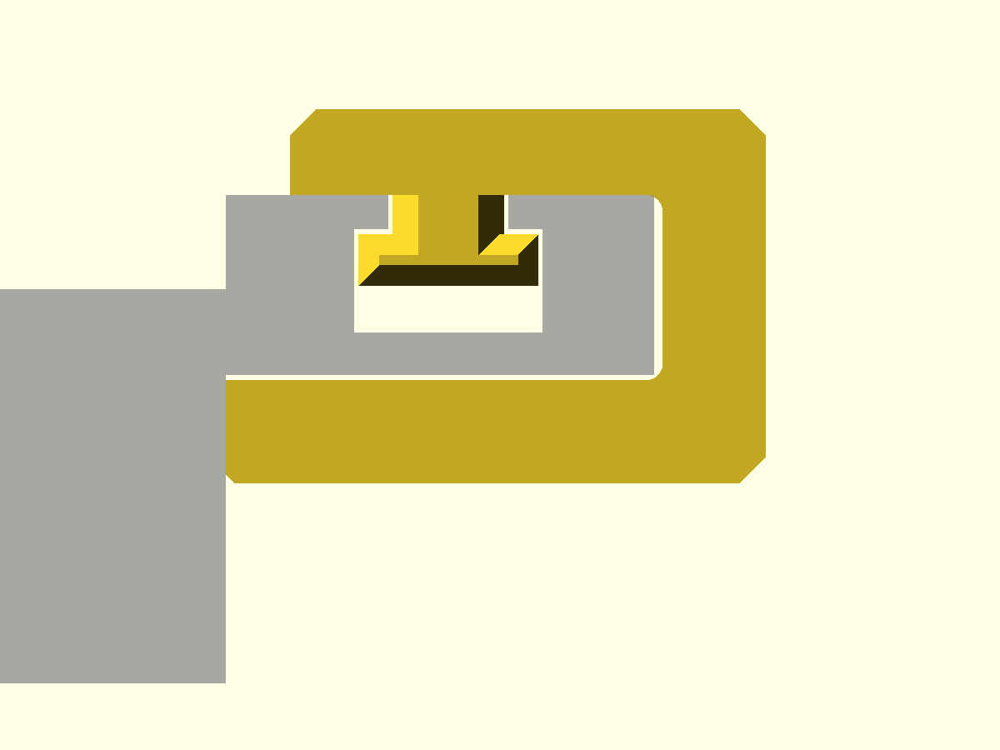

# OpenSCAD Festool Thin Cut

A parametric thin-cut (repeat strip) stop for a Festool FS / FS-2 guide rail.

The jig hooks a key into the T-slot on the **top face at the rail back edge**,
wraps down the outside of the back edge, and returns **under** the rail as a
thin leg lying in the workpiece plane. The inner end face of that leg is the
stop. Butt the workpiece edge against it and the strip under the rail is
exactly `cut_offset` (default 160mm) wide, cut after cut.

Version 0.1.0 ([Semantic Versioning 2.0.0](https://semver.org)).



## Requirements

- OpenSCAD 2021.01 or newer. No libraries (vanilla OpenSCAD).

## Section

Looking along the rail. Cutting edge on the left, back edge on the right.

```
  cutting edge                                  top T-slot   back edge
  x = 0                                             v            |
  |   _________________________________________ __  __ ___      |
  |  |              rail                       |  ||  |   |     |_
  |__|_________________________________________|__[key]___|    | | <- wall
 ======================== workpiece =======|STOP______________| |
 ==========================================|  under leg        |
                                           ^
                                  x = cut_offset (160)
```



- `x = 0` is the cutting edge: the trimmed splinter guard, i.e. the blade face.
- `y = 0` is the rail underside, which is the workpiece top face.
- The **key is the locator**. It is a sliding fit in the slot. The wall only
  wraps the back edge with `edge_clr` clearance and does not locate.
- So the one dimension that sets the strip width is **cutting edge to the
  T-slot centreline**. Measure it and enter it as `slot_c_from_cut_measured`.
  Everything else derives from it.
- The under leg must be thinner than the workpiece (`under_t + under_clr`),
  otherwise it holds the rail off the work.

## Use

1. Slide the jig on from the end of the rail (T key), or drop it in from
   above (`key_style = "bar"`).
2. Set the rail on the workpiece with the workpiece edge against the stop.
3. Cut. The strip under the rail is `cut_offset` wide.

Two jigs, one near each end of the rail, register the rail parallel to the
workpiece edge. One jig alone only sets the width at one point.

## Parameters

| Parameter | Default | Meaning |
|---|---|---|
| `part` | `"jig"` | `"jig"` or `"key_test"` (15mm slice of the key) |
| `show_rail`, `show_workpiece` | true | Ghosts for preview, not exported |
| `cut_offset` | 160 | Cutting edge to stop face = strip width |
| `offset_trim` | 0 | Fine tune after a test cut, + = wider strip |
| `jig_len` | 70 | Length along the rail (print height) |
| `workpiece_t` | 18 | Ghost, and checked against the under leg |
| `rail_w` | 185 | Cutting edge to aluminium back edge. **Measure** |
| `rail_back_h` | 10.5 | Underside to top face at the back edge. **Measure** |
| `slot_c_from_back` | 12 | Back edge to slot centreline. **Measure** |
| `slot_c_from_cut_measured` | 0 | Overrides the above if > 0. **Best single measurement** |
| `slot_open_w` | 7.0 | Slot opening between the lips. **Measure** |
| `slot_lip_t` | 2.0 | Lip thickness. **Measure** |
| `slot_under_w` | 11.0 | Undercut width. **Measure** |
| `slot_under_h` | 6.0 | Undercut height. **Measure** |
| `key_style` | `"T"` | `"T"` slides on from the end, `"bar"` drops in |
| `key_clr` | 0.25 | Per side sliding clearance in the slot |
| `key_vclr` | 0.3 | T head below the lip underside |
| `key_head_h` | 3.0 | T head height |
| `lead_cham` | 1.5 | Lead-in chamfer at both key ends |
| `bridge_t` | 5 | Bridge thickness above the rail |
| `wall_t` | 6 | Wall outside the back edge |
| `edge_clr` | 0.5 | Wall to rail back edge |
| `under_t` | 6 | Under leg thickness. Workpiece must be >= `under_t + under_clr` |
| `under_clr` | 0.3 | Under leg top below the rail underside |
| `inner_fillet` | 1.0 | Inner corner fillets |

Rail defaults are estimates. See `todo.md` for what to measure.

## Print settings

- Print as modelled: section face on the bed, rail direction vertical. Every
  layer holds the whole C, so the wrap and the key neck are strong. No
  supports.
- PETG or PLA, 0.4mm nozzle, 0.2mm layers, 4 walls, 30% infill.
- Print `part = "key_test"` first (a few minutes) and slide it along the
  rail. Adjust `key_clr` or the slot dimensions before printing the jig.
- The stop face is a vertical wall in print, so it is as accurate as the
  printer's XY. Keep it free of seams (set seam to the back / wall side).

## Files

- `festool_thincut.scad` the model
- `exports/festool_thincut_v0.1.0.stl`, `exports/festool_thincut_key_test_v0.1.0.stl`
- `images/` renders
